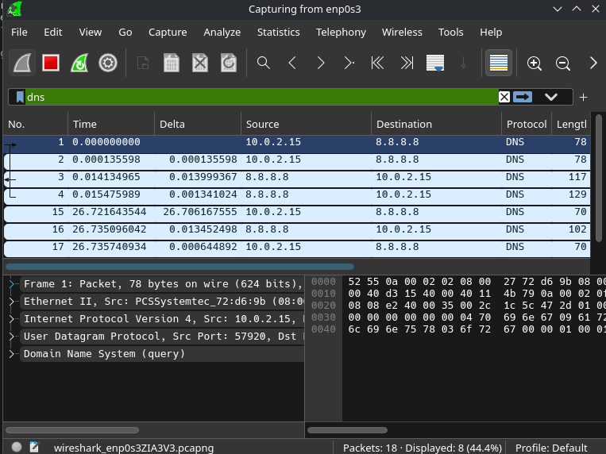
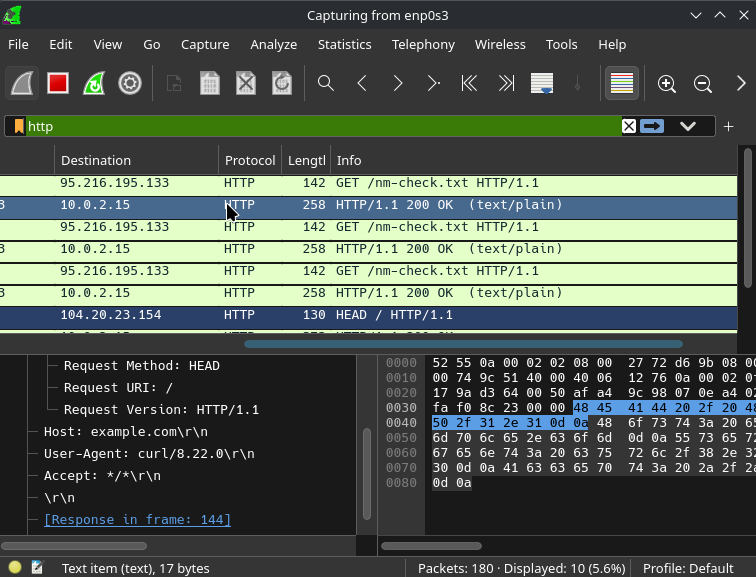
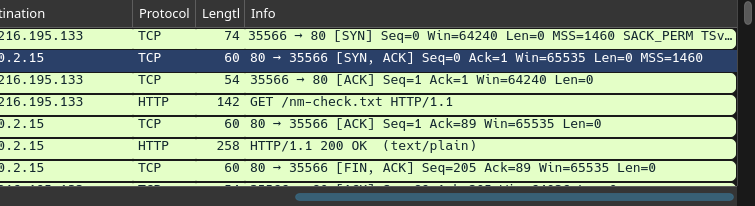
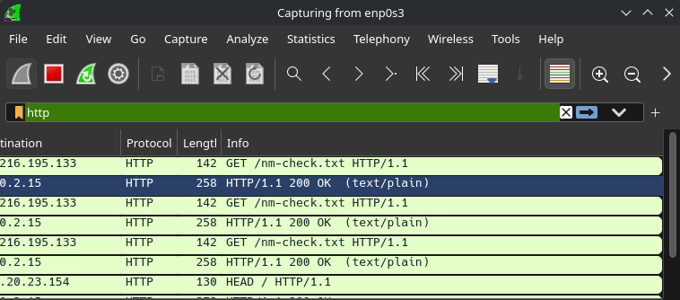

# Network Traffic Analysis

## Objective

The objective of this lab is to analyze network traffic from an Arch Linux virtual machine using Wireshark and understand how common network protocols behave in real traffic.

## Lab Environment

- Operating System: Arch Linux
- Virtualization: VirtualBox
- Network Interface: enp0s3
- IPv4 Address: 10.0.2.15/24
- Default Gateway: 10.0.2.2
- Packet Analyzer: Wireshark
## DNS Analysis

DNS traffic was captured using the Wireshark display filter:

`dns`

A DNS query was observed from the Arch Linux virtual machine to the configured DNS server.

- Source IP: 10.0.2.15
- Destination IP: 8.8.8.8
- Transport Protocol: UDP
- Source Port: 57920
- Destination Port: 53

The corresponding DNS response traveled in the opposite direction, from 8.8.8.8:53 to 10.0.2.15:57920.

The query and response can be correlated using information such as the DNS Transaction ID, source and destination IP addresses, ports, and DNS message contents.
## TCP Analysis

TCP traffic was generated using an HTTP request and captured with Wireshark.

The following TCP three-way handshake was observed:

1. SYN: 10.0.2.15:35566 → 95.216.195.133:80
2. SYN-ACK: 95.216.195.133:80 → 10.0.2.15:35566
3. ACK: 10.0.2.15:35566 → 95.216.195.133:80

This handshake establishes a TCP connection between the client and the server before application data is exchanged.

## HTTP Analysis

Unencrypted HTTP traffic was generated with:

`curl -I http://example.com`

The traffic was captured in Wireshark using the display filter:

`http`

The HTTP request exposed application-layer information in plaintext, including:

- Request Method: HEAD
- Request URI: /
- HTTP Version: HTTP/1.1
- Host: example.com
- User-Agent: curl/8.22.0
- Accept: */*

The server responded with HTTP status code 200 OK.

Because HTTP does not provide encryption, application-layer information can be inspected directly in a packet capture.
## TLS Analysis

Encrypted HTTPS traffic was generated with:

`curl -I https://example.com`

The traffic was captured in Wireshark using the display filter:

`tls`

During the TLS connection, the following traffic was observed:

- TLS Client Hello
- TLS Server Hello
- TLS Application Data
- TLS 1.3

Unlike the previous HTTP capture, the HTTP application data was protected by TLS and could not be directly inspected in plaintext.

The Client Hello exposed some connection metadata, including the Server Name Indication (SNI) for example.com.

This demonstrates an important difference between HTTP and HTTPS: TLS protects the application-layer content while some connection metadata may still remain observable.
